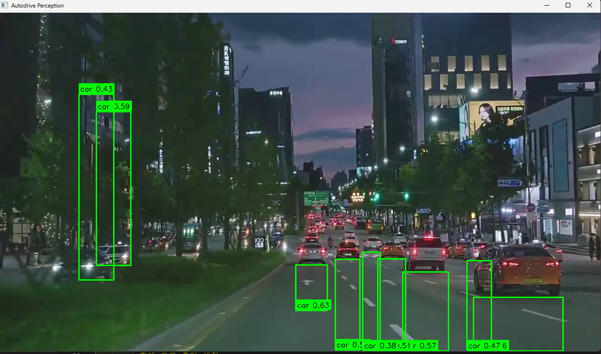
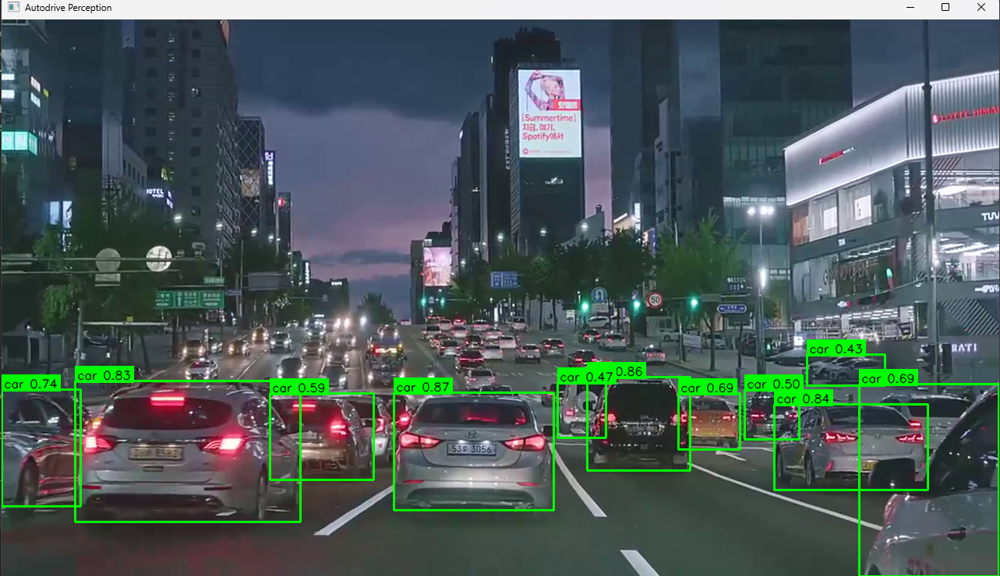

# Experiment: BBox Clamping Issue Investigation

## 목적
- bbox 좌표 보정(clamping) 로직이 객체 탐지 시각화에 미치는 영향 확인
- YOLO 모델 추론 문제와 draw 단계 시각화 문제를 분리하여 원인 분석

---

## 배경
초기 구현에서 pretrained YOLO 기반 객체 탐지가 정상적으로 동작했으나,  
bbox 좌표 안정화를 위해 draw 단계에서 좌표 클램핑을 추가한 이후 다음과 같은 이상 현상이 관찰되었다.

- 차량 bbox가 화면 끝까지 과도하게 늘어나는 현상
- 바닥이나 건물 영역이 car로 인식되는 것처럼 보이는 시각적 왜곡
- bbox 크기/비율이 실제 객체와 맞지 않는 문제

---

## 문제 가설
- YOLO 모델의 추론 결과 자체가 아니라, **draw 단계에서 프레임 경계로 bbox 좌표를 강제 클램핑하면서**  
프레임 밖으로 나간 박스가 화면 끝에 붙어 왜곡되었을 가능성

---

## 테스트 내용
- draw 단계의 bbox 좌표 클램핑 로직 제거
- 동일한 입력 영상 및 동일 구간에서 결과 비교

---

## 결과

### Before: With Clamping

- bbox가 프레임 하단 또는 측면까지 과도하게 확장됨
- 실제 차량보다 훨씬 큰 박스가 표시됨
- 모델 오탐처럼 보이지만, 시각화 단계 왜곡 가능성 존재

---

### After: Without Clamping

- bbox 크기 및 위치가 실제 객체와 일치
- 차량/보행자 인식 결과가 안정적으로 표시됨
- YOLO 추론 결과 자체는 정상임을 확인

---

## 결론
- bbox 이상 현상의 주요 원인은 YOLO 모델이 아니라 **draw 단계에서의 좌표 클램핑 로직**이었음
- 시각화 단계에서는 좌표 보정보다 **필터링(confidence, ROI 등)이 더 안전한 접근**임을 확인
- bbox 좌표 보정은 detector 단계에서 신중히 처리하거나, 필요 시 프레임 밖 박스를 제거하는 방식이 적절해보임

---

## 향후 개선 방향
- draw 단계에서는 bbox 좌표를 그대로 시각화
- detector 단계에서 프레임 밖 bbox 필터링 로직 검토
- ROI 기반 중요도 판단 및 confidence 정책으로 오탐 감소